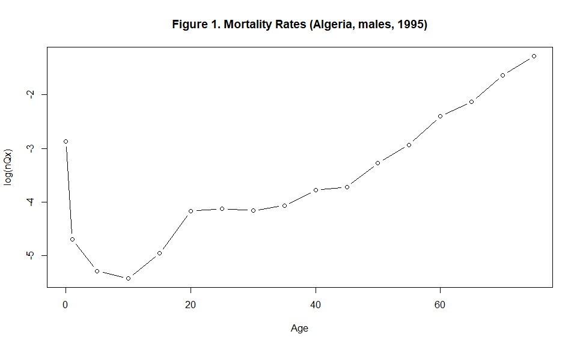
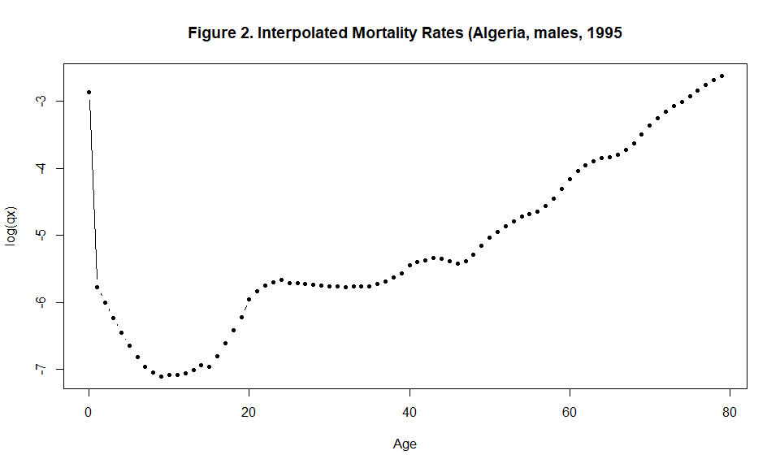

<!-- README.md is generated from README.Rmd. Please edit that file -->

<style> body {text-align: justify} </style>

# Q2q: an R Package for Interpolating Age-Specific Mortality Rates at All Ages

## Description

Mortality Rates are usually published following an abridged description, 
i.e., by age groups 0, `[1, 5[`, `[5, 10[`, `[10, 15[` and so on. 
For some applications, a detailed (single) ages description is required.
Despite the huge number of the proposed methods in the literature, there
is a limited number of methods ensuring a high performance at lower and
higher ages in the same time. For example, the 6-terms `Lagrange`
interpolation function is well adapted to mortality interpolation at
lower ages (with unequal intervals) but is not adapted to higher ages.
On the other hand, the `Karup-King` method allows a good performance at
higher ages but not adapted to lower ages. Interested readers can refer 
to the book of Shryock, Siegel and Associates (1993) for a detailed
overview of the two cited methodsThe package `Q2q` allows
combining both the two methods to allow interpolating mortality rates at
all ages. First, it starts by implementing each method separately, then
the resulted curves are joined based on a 5-age averaged error between
the two curves.

## Installation

You can install the released version of Q2q from
[CRAN](https://CRAN.R-project.org) with:

``` r
install.packages("Q2q")
```

## Functions

The package `Q2q` provides two functions `getqxt()` and `getqx()`.

### getqxt()

The `getqxt()` functions allows interpolating age specific mortality
rates \(ASMRs\) starting from an abridged mortality surface. This later
should provides the five ages mortality rates, usually noted as
\(_nQ_{x,t}\) in the literature, with \(x\) representing the age and
\(t\) the year and \(n\) the length of the age interval which is set to
be \(5\) except for age \(0\) and the age group \(1-5\).

The general formulation of the function is `getqxt(Qxt, nag, t)` with
`Qxt` is the matrix of the five ages mortality rates with no header and
identification column. The number of rows in the matrix should
correspond to the number of age groups refereed as `nag` in the
function. `t` corresponds to the number of years contained in the
mortality matrix, and it should be equal to the number of columns in
`Qxt`.

The function results principally in `qxt` which represents the matrix of
the age-specific mortality rates for age \(x\) and year \(t\). This
matrix had resulted from the junction of two initial matrices `qxtl` and
`qxtk` obtained with the Lagrange and the Karup-King methods
respectively. These two matrices are also provided as function returns.
additionally, for each year \(t\), the junction age is provided in a
vector `$jUnct_ages`. The functions also returns the survivorship matrix
`lxt` and the matrix of theoretical deaths `qxt`.

### getqxt()

The `getqx()` function is a special case of `getqxt()` with `t=1`.

``` r
getqx <- function(Qx,nag) {
                           getqxt(Qxt=Qx, nag, t=1)
                          }
```

## Examples

Lets consider the Algerian mortality surface from 1977 to 2014, for
males, by 5 ages groups.

``` r
LT <- read.table("https://raw.githubusercontent.com/Farid-FLICI/farid-flici.github.io/y/completed_Mortality_Rates_Males_nQx.txt", dec=".", sep="\t", quote="" )

LT <- data.matrix(LT)
```

### Example 1

Lets consider a case of an annual life table (Algeria, males, year
1995).

``` r
Ax <- LT[ 2:18  , 18  ]
Ax
#>  [1] 0.057600000 0.008595076 0.005458048 0.004412398 0.006377689 0.009247171
#>  [7] 0.010432682 0.010874390 0.013575676 0.017743403 0.022464104 0.034233594
#> [13] 0.052863976 0.060080280 0.114340818 0.221651890 0.313934576
```

We plot the mortality curve.

``` r
plot(x=c(0,1, seq(5, (length(Ax)-2)*5, by=5)), y=log(Ax), type="b", xlab="Age", ylab="log(nQx)", main="Figure 1. Mortality Rates (Algeria, males, 1995)" ) 
```



We interpolate \[q_{x,t}\] using `getqx()`

``` r
library(Q2q)
#> 
#> Attaching package: 'Q2q'
#> The following object is masked _by_ '.GlobalEnv':
#> 
#>     getqx
interpolated_curve <-getqx(Qx=Ax, nag=17)
str(interpolated_curve)
#> List of 6
#>  $ qx       : num [1:80, 1] 0.0576 0.00272 0.00231 0.00195 0.00165 ...
#>   ..- attr(*, "dimnames")=List of 2
#>   .. ..$ : chr [1:80] "0" "1" "2" "3" ...
#>   .. ..$ : NULL
#>  $ lx       : num [1:81, 1] 10000 9424 9398 9377 9358 ...
#>   ..- attr(*, "dimnames")=List of 2
#>   .. ..$ : chr [1:81] "0" "1" "2" "3" ...
#>   .. ..$ : NULL
#>  $ dx       : num [1:80, 1] 576 25.7 21.7 18.3 15.4 ...
#>   ..- attr(*, "dimnames")=List of 2
#>   .. ..$ : chr [1:80] "0" "1" "2" "3" ...
#>   .. ..$ : NULL
#>  $ qxk      : num [1:80, 1] 0.0218 0.0164 0.01217 0.00927 0.00779 ...
#>  $ qxl      : num [1:70, 1] 0.0576 0.00272 0.00231 0.00195 0.00165 ...
#>   ..- attr(*, "dimnames")=List of 2
#>   .. ..$ : chr [1:70] "0" "1" "2" "3" ...
#>   .. ..$ : NULL
#>  $ junct_age: num 30
```

plot the interpolated mortality curve using `plot()`

``` r
plot(x=c(0:79), y=log(interpolated_curve$qx), type="b", xlab="Age", ylab="log(qx)", main="Figure 2. Interpolated Mortality Rates (Algeria, males, 1995")
```



``` r
plot(x=c(5:79), y=log(interpolated_curve$qxk[6:80]), type="p", cex=0.75, pch=1,xlab="Age", ylab="log(qx)", main="Figure 3. Interpolated Mortality Rates (Algeria, males, 1995) - Junction age", xlim=c(0,80))
lines(x=c(0:69), y=log(interpolated_curve$qxl), lwd=2)
lines(x=rep(interpolated_curve$junct_age, 2), y=c(min(log(interpolated_curve$qxl)),max(log(interpolated_curve$qxk))), lty=2, lwd=1.25, col="red")
```


### Example 2

Lets consider the following mortality surface with of a dimension 17 by
38, the Algerian mortality surface from 1977 to 2014 for males.

``` r
Bxt <- LT[2:18, 2:39]
head(Bxt[  ,1:5 ])
#>              V2         V3         V4          V5          V6
#> [1,] 0.12771000 0.11457000 0.10983285 0.107010000 0.101360000
#> [2,] 0.05712550 0.04550331 0.05024614 0.053628820 0.050487403
#> [3,] 0.01737471 0.02004402 0.01430249 0.010897732 0.010348424
#> [4,] 0.01218803 0.01563632 0.01006031 0.006878649 0.006382928
#> [5,] 0.01319020 0.01601963 0.01230083 0.010250912 0.009546511
#> [6,] 0.01533404 0.01735250 0.01615231 0.016405813 0.015426454
tail(Bxt[  ,1:5 ])
#>               V2         V3         V4         V5         V6
#> [12,] 0.05676323 0.04748539 0.05589881 0.06149508 0.05773371
#> [13,] 0.07900273 0.08034157 0.08121839 0.08712466 0.08291744
#> [14,] 0.11802724 0.11413719 0.11408799 0.11920273 0.11195253
#> [15,] 0.17857622 0.15288799 0.16690673 0.16547548 0.16143084
#> [16,] 0.27407753 0.23679338 0.22764444 0.21208642 0.19996918
#> [17,] 0.40216832 0.35013558 0.34325999 0.33074950 0.30638017
```

The surface of `log(nQxt)` can be plotted using

``` r
persp(x=c(0,1, seq(5,75, by=5)), y=c(1977:2014), z=log(Bxt), theta=-10, expand = 0.8 , phi=25, xlab="age", ylab="year", zlab="log (nQxt)", main="Figure 4. Five ages mortality surface, Algeria, males, 1977-2014")
```


Then lets deduce the single ages mortality surface using `getqxt()`

``` r
interpolated_surface <- getqxt(Qxt=Bxt, nag=17, t=38)

str(interpolated_surface)
#> List of 6
#>  $ qxt       : num [1:80, 1:38] 0.12771 0.02187 0.01629 0.01181 0.00837 ...
#>   ..- attr(*, "dimnames")=List of 2
#>   .. ..$ : chr [1:80] "0" "1" "2" "3" ...
#>   .. ..$ : NULL
#>  $ lxt       : num [1:81, 1:38] 10000 8723 8532 8393 8294 ...
#>   ..- attr(*, "dimnames")=List of 2
#>   .. ..$ : chr [1:81] "0" "1" "2" "3" ...
#>   .. ..$ : NULL
#>  $ dxt       : num [1:80, 1:38] 1277.1 190.8 139 99.1 69.4 ...
#>   ..- attr(*, "dimnames")=List of 2
#>   .. ..$ : chr [1:80] "0" "1" "2" "3" ...
#>   .. ..$ : NULL
#>  $ qxtk      : num [1:80, 1:38] 0.0587 0.046 0.0353 0.0276 0.0236 ...
#>  $ qxtl      : num [1:70, 1:38] 0.12771 0.02187 0.01629 0.01181 0.00837 ...
#>   ..- attr(*, "dimnames")=List of 2
#>   .. ..$ : chr [1:70] "0" "1" "2" "3" ...
#>   .. ..$ : NULL
#>  $ junct_ages: num [1, 1:38] 16 15 26 62 46 45 28 30 30 29 ...
```

``` r
persp(x=c(0:79), y=c(1977:2014), z=log(interpolated_surface$qxt), theta=-10, expand = 0.8 , phi=25, xlab="age", ylab="year", zlab="log (qxt)", main="Figure 5. Detailled ages mortality surface, Algeria, males, 1977-2014")
```


## References

Shryock, H. S., Siegel, J. S. and Associates (1993). Interpolation: Selected General Methods. In: D. J. Bogue, E. E. Arriaga, D. L. Anderton and G. W. Rumsey (eds), Readings in Population Research Methodology. Vol.1: Basic Tools. Social Development Center/ UN Population Fund, Chicago, pp. 5-48-5-72.
