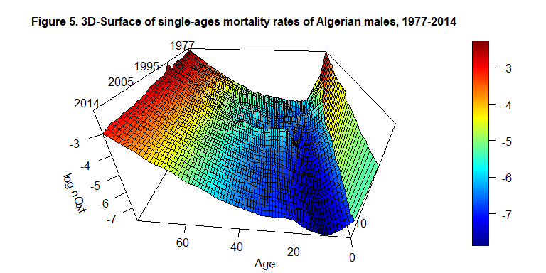

<!-- README.md is generated from README.Rmd. Please edit that file -->
<style> body {text-align: justify} </style>

# Q2q: an R Package for Interpolating Age-Specific Mortality Rates at all Ages

## Description

Mortality rates are typically provided in an abridged form, i.e., by age
groups 0, ‘\[1, 5\]’, ‘\[5, 10\]’, ‘\[10, 15\]’, and so on. Some
applications require a detailed (single) age description. Despite the
enormous number of suggested techniques in the literature, only a few
solutions provide good results at both younger and older ages. For
example, the 6-term ‘Lagrange’ interpolation function is appropriate for
mortality interpolation at younger ages (with irregular intervals), but
not at older ages. The ‘Karup-King’ method, on the other hand, works
well for older age groups but is not appropriate for younger ones.
Shryock, Siegel, and Associates (1993) provide an in-depth description
of the two methods mentioned.The Q2q package combines the two
approaches, allowing for interpolation of mortality rates over all age
groups. Each approach is implemented independently, and the resulting
curves are merged at the age at which the two partial curves show the
smallest 5-age averaged error.

## Installation

You can install the released version of Q2q from
[CRAN](https://CRAN.R-project.org) with:

``` r
#install.packages("Q2q")
```

Before it can be used, the package needs to be called.

``` r
library(Q2q)
```

## Functions

The package `Q2q` provides two functions `getqxt()` and `getqx()`.

### getqxt()

The `getqxt()` function allows interpolating age specific mortality
rates $ASMRs$ starting from an abridged mortality surface. An abridged
mortality surface provides the five ages mortality rates, usually noted
as $_nQ_{x,t}$, with $x$ representing the age and $t$ the year and $n$
the length of the age interval which is set to be $5$ except for age $0$
and the age group $1-4$.

The general form of the function is `getqxt(Qxt, nag, t)` , where `Qxt`
is the matrix (or a numerical data frame) of the five ages mortality
rates without a header or identification column. The number of rows in
the matrix should be equal to the number of age groups referred to as
`nag` in the function. The number of years in the mortality matrix,
denoted by `t` , should be equal to the number of columns in `Qxt`.

The primary output of the function is `qxt`, which is a matrix of the
age-specific death rates for a given age $x$ and year $t$. This matrix
was the product of the junction of two initial matrices, `qxtl` and
`qxtk`, that were produced using the Karup-King and Lagrange methods,
respectively. Additionally, these two matrices are given as function
outputs. Moreover, the junction age is given as a vector `jUnct_ages`
for every year $t$. In addition, the function returns the theoretical
death matrix `qxt` and the survivorship matrix `lxt`.

### getqx()

The `getqx()` function is a special case of `getqxt()` with `t=1`.

``` r
getqx <- function(Qx,nag) {
                           getqxt(Qxt=Qx, nag, t=1)
                          }
```

## Results Validation

In order to assess the quality of the interpolated mortality rates, two
types of tests are included in the `Q2q` package: the Fidelity Test and
the Zero-One Test, which were implemented as “Unit tests” in the package
and can be used by users to validate their own results. Both test were
developed using the `testthat` package and the test outcome come either
as `Test passed` or `Test failed`.

``` r
library(testthat)
#> Warning: le package 'testthat' a été compilé avec la version R 4.2.3
```

### The Fidelity Test

The Fidelity Test measure the likelihood between the original five-years
mortality rates (before interpolation), i.e.`Qxt`, and those
recalculated from the interpolated rates, i.e., `Qxt_test`. Good results
suggest that the errors observed between `Qxt` and `Qxt_test` to be
below a well defined ceiling at all ages. In our case, we defined the
maximum tolered error at `0.005`, which seems reasonable in the case of
five-age mortality rates.

``` r
data("LT")
```

The test can be implemented using the following code:

``` r
test_that("Fidelity test", {
 #   data("LT")
  Qxt = LT
  expect_equal(getqxt(Qxt, nag=nrow(Qxt), t=ncol(Qxt))$Qxt,getqxt(Qxt, nag=nrow(Qxt), t=ncol(Qxt))$Qxt_test ,tolerance=0.005)

  Qx = LT[, 11]
  expect_equal( getqx(Qx, nag=length(Qx))$Qxt, getqx(Qx, nag=length(Qx))$Qxt_test,tolerance=0.005)
   })
#> Test passed
```

### The Zero-One Test

The `Zero-One Test` aims to ensure that the interpolated rates are all
comprised between 0 and 1. Under specific circumstances, a high
fluctuation of five-age mortality rates (e.g. crude rates), the
interpolated rates can be situated outside the 0-1 interval. This test
aims at making sure that this is not the case. The following code can be
used to implement the test:

``` r
test_that("zero-one test", {
#  data("LT")
  Qxt = LT
  q = getqxt(Qxt, nag=nrow(Qxt), t=ncol(Qxt))$qxt
  n = nrow(q)
  t = ncol(q)
  expect_true(all(q>0 & q<=1))

  Qx = LT[, 11]
  q = getqx(Qx, nag=length(Qx))$qx
  n = nrow(q)
  t = ncol(q)
  expect_true(all(q>0 & q<=1))
})
#> Test passed
```

## Examples

The package comes with a dataset containing the Algerian mortality
surface from 1977 to 2014, for males, by 5 ages groups. We use the
provided dataset for the two first examples. Data from external sources
(Japonese Mortality Database) are used in the two last examples.

``` r
data("LT")
```

### Example 1

Lets consider a case of an annual life table (Algeria, males, year
1995).

``` r
Ax <- LT[,18]
Ax
#>  [1] 0.056800000 0.009117897 0.005028889 0.004409076 0.007020197 0.015444855
#>  [7] 0.016129032 0.015607456 0.017109616 0.022745735 0.024106401 0.037843758
#> [13] 0.053243961 0.090569062 0.118830787 0.194365728 0.278272707
```

We plot the mortality curve.

``` r
plot(x=c(0,1, seq(5, (length(Ax)-2)*5, by=5)), y=log(Ax), type="b", xlab="Age", ylab="log(nQx)", main="Figure 1. Mortality Rates (Algeria, males, 1995)", cex=1 ) 
```


We interpolate `q_{x,t}` using `getqx()`

``` r
interpolated_curve <-getqx(Qx=Ax, nag=17)
str(interpolated_curve)
#> List of 8
#>  $ qx       : num [1:80, 1] 0.0568 0.00311 0.00247 0.00197 0.00159 ...
#>   ..- attr(*, "dimnames")=List of 2
#>   .. ..$ : chr [1:80] "0" "1" "2" "3" ...
#>   .. ..$ : NULL
#>  $ lx       : num [1:81, 1] 10000 9432 9403 9379 9361 ...
#>   ..- attr(*, "dimnames")=List of 2
#>   .. ..$ : chr [1:81] "0" "1" "2" "3" ...
#>   .. ..$ : NULL
#>  $ dx       : num [1:80, 1] 568 29.4 23.3 18.5 14.9 ...
#>   ..- attr(*, "dimnames")=List of 2
#>   .. ..$ : chr [1:80] "0" "1" "2" "3" ...
#>   .. ..$ : NULL
#>  $ qxk      : num [1:80, 1] 0.02178 0.01634 0.01209 0.00918 0.00771 ...
#>  $ qxl      : num [1:70, 1] 0.0568 0.00311 0.00247 0.00197 0.00159 ...
#>   ..- attr(*, "dimnames")=List of 2
#>   .. ..$ : chr [1:70] "0" "1" "2" "3" ...
#>   .. ..$ : NULL
#>  $ junct_age: num 44
#>  $ Qxt      : num [1:17, 1] 0.0568 0.00912 0.00503 0.00441 0.00702 ...
#>   ..- attr(*, "dimnames")=List of 2
#>   .. ..$ : chr [1:17] "0" "1" "5" "10" ...
#>   .. ..$ : NULL
#>  $ Qxt_test : num [1:17, 1] 0.0568 0.00912 0.00503 0.00441 0.00702 ...
#>   ..- attr(*, "dimnames")=List of 2
#>   .. ..$ : chr [1:17] "0" "1" "5" "10" ...
#>   .. ..$ : NULL
```

We plot the interpolated mortality curve using `plot()`

``` r
plot(x=c(0:79), y=log(interpolated_curve$qx), type="b", pch=19, xlab="Age", ylab="log(qx)", main="Figure 2. Interpolated Mortality Rates (Algeria, males, 1995", cex=0.75)
```


``` r
plot(x=c(5:79), y=log(interpolated_curve$qxk[6:80]), type="l", lwd=5, pch=1,xlab="Age", ylab="log(qx)", main="Figure 3. Interpolated Mortality Rates (Algeria, males, 1995) - Junction age", xlim=c(0,80), col="gray", alpha=0.5)
#> Warning in plot.window(...): "alpha" n'est pas un paramètre graphique
#> Warning in plot.xy(xy, type, ...): "alpha" n'est pas un paramètre graphique
#> Warning in axis(side = side, at = at, labels = labels, ...): "alpha" n'est pas
#> un paramètre graphique

#> Warning in axis(side = side, at = at, labels = labels, ...): "alpha" n'est pas
#> un paramètre graphique
#> Warning in box(...): "alpha" n'est pas un paramètre graphique
#> Warning in title(...): "alpha" n'est pas un paramètre graphique
lines(x=c(0:69), y=log(interpolated_curve$qxl), lwd=2)
lines(x=rep(interpolated_curve$junct_age, 2), y=c(min(log(interpolated_curve$qxl)),max(log(interpolated_curve$qxk))), lty=2, lwd=1.25, col="red")
legend(x=2, y=-3, c("Lagrange Method", "Karup-King Method", "Junction age"), lty=c(1,1,2), col=c("black", "gray", "red"), lwd=c(2,5,2))
```


We validate the obtained results using the fidelity test and the
Zero-One test.

``` r
test_that("Fidelity test", {
 # data("LT")
  Qx = LT[, 11]
  expect_equal( getqx(Qx, nag=length(Qx))$Qxt, getqx(Qx, nag=length(Qx))$Qxt_test,tolerance=0.005)
   })
#> Test passed

test_that("zero-one test", {
 # data("LT")
  Qx = LT[, 11]
  q = getqx(Qx, nag=length(Qx))$qx
  n = nrow(q)
  t = ncol(q)
  expect_true(all(q>0 & q<=1))
})
#> Test passed
```

### Example 2

Lets consider the following mortality surface with a dimension of 17
(age groups) by 38 (calendar years), the Algerian mortality surface from
1977 to 2014 for males.

``` r
Bxt <- LT
head(Bxt[  ,1:5 ])
#>         X1977      X1978      X1979       X1980       X1981
#> 0  0.12771000 0.11457000 0.10983285 0.107010000 0.101360000
#> 1  0.05712550 0.04550331 0.05024614 0.053628820 0.050487403
#> 5  0.01737471 0.02004402 0.01430249 0.010897732 0.010348424
#> 10 0.01218803 0.01563632 0.01006031 0.006878649 0.006382928
#> 15 0.01319020 0.01601963 0.01230083 0.010250912 0.009546511
#> 20 0.01533404 0.01735250 0.01615231 0.016405813 0.015426454
tail(Bxt[  ,1:5 ])
#>         X1977      X1978      X1979      X1980      X1981
#> 50 0.05676323 0.04748539 0.05589881 0.06149508 0.05773371
#> 55 0.07900273 0.08034157 0.08121839 0.08712466 0.08291744
#> 60 0.11802724 0.11413719 0.11408799 0.11920273 0.11195253
#> 65 0.17857622 0.15288799 0.16690673 0.16547548 0.16143084
#> 70 0.27407753 0.23679338 0.22764444 0.21208642 0.19996918
#> 75 0.40216832 0.35013558 0.34325999 0.33074950 0.30638017
```

The 3D-surface representing the `log(nQxt)` can be plotted using the
$persp3D$ of the $3Dplot$ package.

``` r
library(plot3D)
#> Warning: le package 'plot3D' a été compilé avec la version R 4.2.3
par(mar=c(2,2,3,3))
persp3D(x=c(0,1, seq(5,75, by=5)), y=c(1977:2014), z=log(as.matrix(Bxt)), phi = 30, theta = - 175, border = "black", facets = TRUE, inttype = 1, add = F, ticktype = "detailed", expand = .6, scale=1.5, r=.6, box=TRUE, xlab="Age", ylab=NULL, zlab="log nQxt", plot=F, axes=T, main="Figure 4. 3D-Surface of Five-ages mortality rates of Algerian males, 1977-2014", cex.main=1 )

text3D(x= 80, y=2010, z= 0.5, labels=c("Year"), add = T, plot=F)
text3D(x= c(82, 80, 80, 76), y=c(1983, 2001, 2008, 2016), z= c(-0.4,-0.5,-0.6,-0.4), labels=c("1977", "1995", "2005", "2014"), add = T)
```


Then, we deduce matrix of the single ages mortality rates using
`getqxt() of the $Q2q$` package.

``` r
interpolated_surface <- getqxt(Qxt=Bxt, nag=17, t=38)
str(interpolated_surface)
#> List of 8
#>  $ qxt       : num [1:80, 1:38] 0.12771 0.02187 0.01629 0.01181 0.00837 ...
#>   ..- attr(*, "dimnames")=List of 2
#>   .. ..$ : chr [1:80] "0" "1" "2" "3" ...
#>   .. ..$ : NULL
#>  $ lxt       : num [1:81, 1:38] 10000 8723 8532 8393 8294 ...
#>   ..- attr(*, "dimnames")=List of 2
#>   .. ..$ : chr [1:81] "0" "1" "2" "3" ...
#>   .. ..$ : NULL
#>  $ dxt       : num [1:80, 1:38] 1277.1 190.8 139 99.1 69.4 ...
#>   ..- attr(*, "dimnames")=List of 2
#>   .. ..$ : chr [1:80] "0" "1" "2" "3" ...
#>   .. ..$ : NULL
#>  $ qxtk      : num [1:80, 1:38] 0.0587 0.046 0.0353 0.0276 0.0236 ...
#>  $ qxtl      : num [1:70, 1:38] 0.12771 0.02187 0.01629 0.01181 0.00837 ...
#>   ..- attr(*, "dimnames")=List of 2
#>   .. ..$ : chr [1:70] "0" "1" "2" "3" ...
#>   .. ..$ : NULL
#>  $ junct_ages: num [1, 1:38] 16 15 26 62 46 45 28 30 30 29 ...
#>  $ Qxt       : num [1:17, 1:38] 0.1277 0.0571 0.0174 0.0122 0.0132 ...
#>   ..- attr(*, "dimnames")=List of 2
#>   .. ..$ : chr [1:17] "0" "1" "5" "10" ...
#>   .. ..$ : chr [1:38] "X1977" "X1978" "X1979" "X1980" ...
#>  $ Qxt_test  : num [1:17, 1:38] 0.1277 0.0571 0.0174 0.0122 0.0132 ...
#>   ..- attr(*, "dimnames")=List of 2
#>   .. ..$ : chr [1:17] "0" "1" "5" "10" ...
#>   .. ..$ : chr [1:38] "X1977" "X1978" "X1979" "X1980" ...
```

The obtained result can be represented using a 3D-surface.

``` r

par(mar=c(2,2,3,3))
persp3D(x=c(0:79), y=c(1977:2014), z=log(interpolated_surface$qxt), phi = 30, theta = - 175, border = "black", facets = TRUE, inttype = 1, add = F, ticktype = "detailed", expand = .6, scale=1.5, r=.6, box=TRUE, xlab="Age", ylab=NULL, zlab="log nQxt", plot=F, axes=T , main="Figure 5. 3D-Surface of single-ages mortality rates of Algerian males, 1977-2014", cex.main=1 )

text3D(x= 80, y=2010, z= 0.5, labels=c("Year"), add = T, plot=F)
text3D(x= c(84, 82, 82, 79), y=c(1983, 2001, 2008, 2016), z= c(-1.5,-1.5,-1.6,-1.5), labels=c("1977", "1995", "2005", "2014"), add = T)
```



We validate the obtained results using the Fidelity Test and the
Zero-One Test:

``` r
test_that("Fidelity test", {
 # data("LT")
  Qxt = LT
  expect_equal(getqxt(Qxt, nag=nrow(Qxt), t=ncol(Qxt))$Qxt,getqxt(Qxt, nag=nrow(Qxt), t=ncol(Qxt))$Qxt_test ,tolerance=0.005)
     })
#> Test passed

test_that("Fidelity test", {
  data("LT")
  Qxt = LT
  expect_equal(getqxt(Qxt, nag=nrow(Qxt), t=ncol(Qxt))$Qxt,getqxt(Qxt, nag=nrow(Qxt), t=ncol(Qxt))$Qxt_test ,tolerance=0.005)
   })
#> Test passed
```

### Example 3

Lets consider the case of Japanese females in 1950. The dataset can be
retrieved from the Japanese Mortality Database , which has a similar
structure as the Human Mortality Database and it can be accessed without
a prior registration.

``` r
library(tidyverse)
#> Warning: le package 'tidyverse' a été compilé avec la version R 4.2.3
#> Warning: le package 'ggplot2' a été compilé avec la version R 4.2.3
#> Warning: le package 'readr' a été compilé avec la version R 4.2.3
#> Warning: le package 'lubridate' a été compilé avec la version R 4.2.3
#> ── Attaching core tidyverse packages ──────────────────────── tidyverse 2.0.0 ──
#> ✔ dplyr     1.1.0     ✔ readr     2.1.4
#> ✔ forcats   1.0.0     ✔ stringr   1.5.0
#> ✔ ggplot2   3.4.3     ✔ tibble    3.1.8
#> ✔ lubridate 1.9.3     ✔ tidyr     1.3.0
#> ✔ purrr     1.0.1     
#> ── Conflicts ────────────────────────────────────────── tidyverse_conflicts() ──
#> ✖ readr::edition_get()   masks testthat::edition_get()
#> ✖ dplyr::filter()        masks stats::filter()
#> ✖ purrr::is_null()       masks testthat::is_null()
#> ✖ dplyr::lag()           masks stats::lag()
#> ✖ readr::local_edition() masks testthat::local_edition()
#> ✖ dplyr::matches()       masks tidyr::matches(), testthat::matches()
#> ℹ Use the ]8;;http://conflicted.r-lib.org/conflicted package]8;; to force all conflicts to become errors
# Upload the dataset
LT_3 = read.csv(url("https://www.ipss.go.jp/p-toukei/JMD/00/STATS/fltper_5x1.txt"), sep="", header = F)

# Data manipulation & Preparation 
LT_3 = LT_3[-c(1),]
colnames(LT_3) = LT_3[1,]
LT_3 = LT_3[-c(1),]

# Select only the variables of interest (Age and qx)
LT_3 = LT_3 %>% filter(LT_3$Year==1950) %>% select(c(2,4))

# Make sure the dataset is a numerical vector/matrix
m = 19
Qx = as.numeric(LT_3$qx[1:m])

# Plotting the five-age mortality rates
plot(x=c(0,1, seq(5, (length(Qx)-2)*5, by=5)), y=log(Qx), type="b", xlab="Age", ylab="log(nQx)", main="Figure 6. 5-Age Mortality Rates (Japan, females, 1950)", cex=1 ) 
```


``` r

# Interpolating Mortality Rates
qx = getqx(Qx, nag=m)

# Plotting the five-age mortality rates
plot(x=c(0:(5*(m-1)-1)), y=log(qx$qx), type="b", pch=19, xlab="Age", ylab="log(qx)", main="Figure 7. Interpolated Mortality Rates (Japan, females, 1950)", cex=0.75)
```


``` r

# Results Validation (1): Fidelity Test
test_that("Fidelity test", {
  Qx = Qx
  expect_equal( getqx(Qx, nag=length(Qx))$Qxt, getqx(Qx, nag=length(Qx))$Qxt_test,tolerance=0.005)
   })
#> Test passed

# Results Validation (2): Zero-One Test
test_that("zero-one test", {
  Qx = Qx
  q = getqx(Qx, nag=length(Qx))$qx
  n = nrow(q)
  t = ncol(q)
  expect_true(all(q>0 & q<=1))
})
#> Test passed
```

### Example 4

``` r
library(reshape2)
#> Warning: le package 'reshape2' a été compilé avec la version R 4.2.3
#> 
#> Attachement du package : 'reshape2'
#> L'objet suivant est masqué depuis 'package:tidyr':
#> 
#>     smiths
library(tidyverse)

# Upload the data 

LT_4 = read.csv(url("https://www.ipss.go.jp/p-toukei/JMD/00/STATS/fltper_5x1.txt"), sep="", header = F)

# Data preparation (Make sure the dataset provided is a numerical matrix)
LT_4_1 = LT_4[-c(1),] 
colnames(LT_4_1) = LT_4_1[1,]
LT_4_1 = LT_4_1[-c(1),]
LT_4_1 = LT_4_1 %>% mutate(Age = recode(Age, "0"=0, "1-4"=1,"5-9"=5, "10-14"=10, "15-19"=15, "20-24"=20, "25-29" = 25, "30-34" = 30, "35-39" = 35, "40-44" = 40, "45-49" = 45, "50-54" = 50, "55-59" = 55, "60-64" = 60, "65-69" = 65, "70-74" = 70, "75-79" = 75, "80-84" = 80, "85-89" = 85, "90-94" = 90, "95-99" = 95, "100-104" = 100, "105-109" = 105, "110+" = 110  ))
LT_4_1 = as.data.frame(LT_4_1) %>% mutate(Age=as.numeric(Age), Year = as.numeric(Year), qx=as.numeric(qx))

LT_4_2 = LT_4_1 %>% filter( Year %in% c(1950:1970), Age %in% c(0:85) ) %>% select(Age, Year, qx)
LT_4_2 = dcast(LT_4_2, Age~Year)
#> Using qx as value column: use value.var to override.
rownames(LT_4_2) = LT_4_2$Age
LT_4_2 = LT_4_2 %>% select(-c(Age))
LT_4_2 = as.matrix(LT_4_2)
m = 19
p=21

# Plotting the five-age mortality rates for Japan, females, 1950-1969

library(plot3D)

par(mar=c(2,2,3,3))
persp3D(x=c(0,1, seq(5,85, by=5)), y=c(1950:1970), z=log(LT_4_2), phi = 30, theta = - 175, border = "black", facets = TRUE, inttype = 1, add = F, ticktype = "detailed", expand = .6, scale=1.5, r=.6, box=TRUE, xlab="Age", ylab=NULL, zlab="log nQxt", plot=F, axes=T, main="Figure 8. 3D-Surface of Five-ages mortality rates of Japanese females, 1950-1970", cex.main=1 )

text3D(x= 95, y=1968, z= 0.8, labels=c("Year"), add = T, plot=F)
text3D(x= c(98, 92, 86), y=c(1953, 1963, 1973), z= c(0.15,0.15,0.15), labels=c("1950", "1960", "1970"), add = T)
```


``` r

# Interpolating age-specific mortality rates using getqxt function

LT_4_int = getqxt(LT_4_2, nag=19, t=21)

# Plotting the 3D surface of the interpolated mortality rates

library(plot3D)

par(mar=c(2,2,3,3))

persp3D(x=c(0:89), y=c(1950:1970), z=log((LT_4_int$qxt)), phi = 30, theta = - 175, border = "black", facets = TRUE, inttype = 1, add = F, ticktype = "detailed", expand = .6, scale=1.5, r=.6, box=TRUE, xlab="Age", ylab=NULL, zlab="log nQxt", plot=F, axes=T, main="Figure 9. 3D-Surface of age-specific mortality rates of Japanese females, 1950-1970", cex.main=1 )

text3D(x= 95, y=1968, z= 0.8, labels=c("Year"), add = T, plot=F)
text3D(x= c(96, 94, 80), y=c(1959, 1967, 1975), z= c(-0.1,-0.15,0.2), labels=c("1950", "1960", "1970"), add = T)
```


``` r

# Results Validation
test_that("Fidelity test", {
  Qxt = LT_4_2
  expect_equal(getqxt(Qxt, nag=nrow(Qxt), t=ncol(Qxt))$Qxt,getqxt(Qxt, nag=nrow(Qxt), t=ncol(Qxt))$Qxt_test ,tolerance=0.005)
     })
#> Test passed

test_that("zero-one test", {
  Qxt = LT_4_2
  q = getqxt(Qxt, nag=nrow(Qxt), t=ncol(Qxt))$qxt
  n = nrow(q)
  t = ncol(q)
  expect_true(all(q>0 & q<=1))
})
#> Test passed
```

## References

Shryock, H. S., Siegel, J. S. and Associates (1993). Interpolation:
Selected General Methods. In: D. J. Bogue, E. E. Arriaga, D. L. Anderton
and G. W. Rumsey (eds), Readings in Population Research Methodology.
Vol.1: Basic Tools. Social Development Center/ UN Population Fund,
Chicago, pp. 5-48-5-72.
